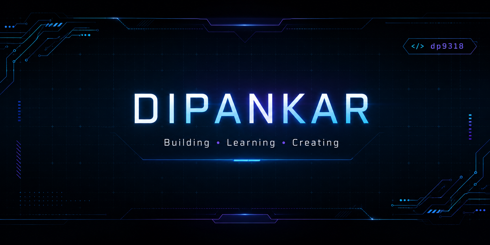

  

---

<h2>🚀 About Me</h2>

- 🎓 MCA Student at MANIT Bhopal
- ☕ Java-first developer with a strong computer science foundation
- 🤖 Exploring Machine Learning and Artificial Intelligence
- 🌐 Building modern web applications and Android projects
- 📊 Passionate about data analytics and visualization

---

## 📊 GitHub Analytics

<!-- Stats will be added here -->
  

---

## 🛠️ Tech Stack

<h3>💻 Languages</h3>

<h3>🌐 Web</h3>

<h3>📊 Data & Tools</h3>

<!-- Shiny badges will go here -->

---

## 🚀 Featured Projects

<table>
<tr>
<td width="50%">

### 🎮 [Epic Games Clone](https://github.com/dp9318/Epic-Games-Clone) 

A pixel-inspired recreation of the Epic Games Store built to explore responsive layouts, component architecture, and modern frontend development practices.

</td>

<td>

### 🌍 [Quake Report](https://github.com/dp9318/Quake-Report)  

An Android application built in Java that fetches real-time earthquake data from the USGS API and displays it in a clean, animated list interface with detailed event information.
  
</td>

</tr>

<tr>

<td width="50%">

### 📊 [Video Game Sales Analysis](https://github.com/dp9318/Game-Sales-Analysis-1971-2024-) 

Power BI dashboard analyzing more than 50 years of global video game sales data for trends and insights.

</td>

<td width="50%">

### 🥛 [Liquid Food Purity Analyzer(planned)](https://github.com/dp9318/Liquid-Food-Analyzer) 

A future machine learning project focused on detecting adulteration in liquid food using microscopic image analysis and computer vision techniques.

</td>

</tr>
</table>

---

## 🎯 Current Focus

- 🎯 Strengthening DSA in Java
- 🚀 Building production-quality projects
- 🤖 Learning Machine Learning
- 💼 Preparing for internships

---

## 🌐 Connect With Me

 
   
  
   
  
   
  
   

  

---

⭐ Thanks for stopping by! Feel free to explore my projects and connect with me.

